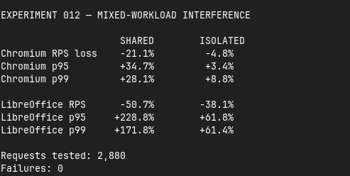
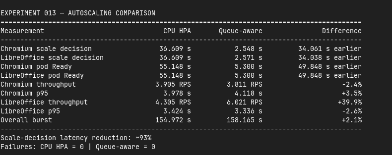
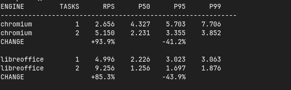
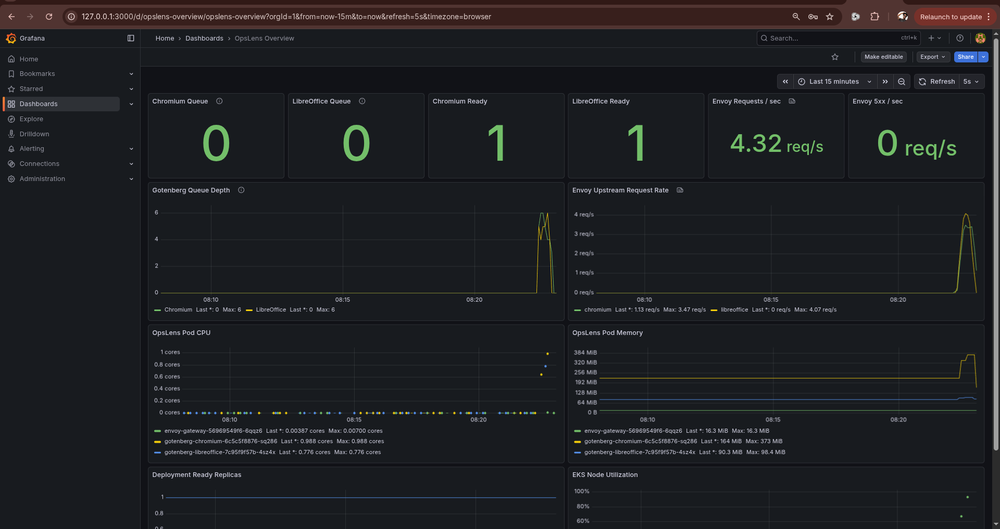
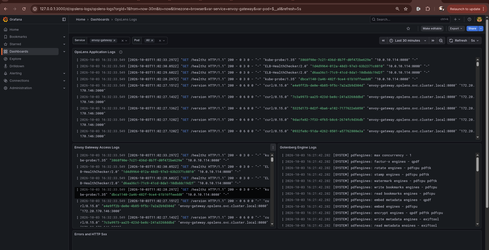
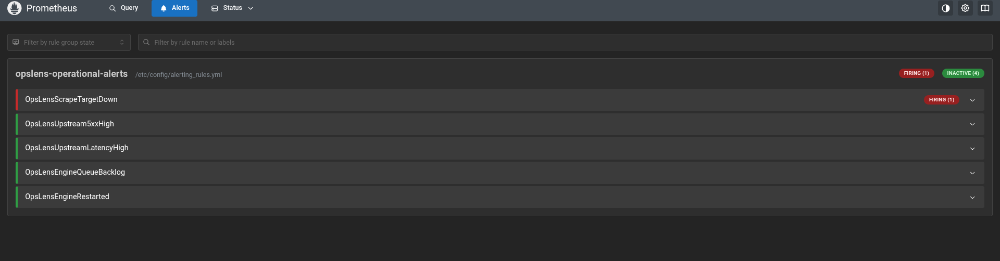
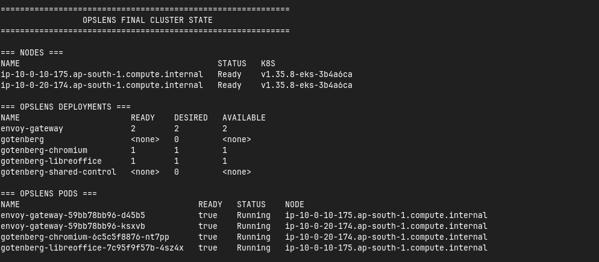
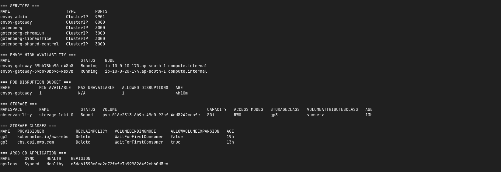
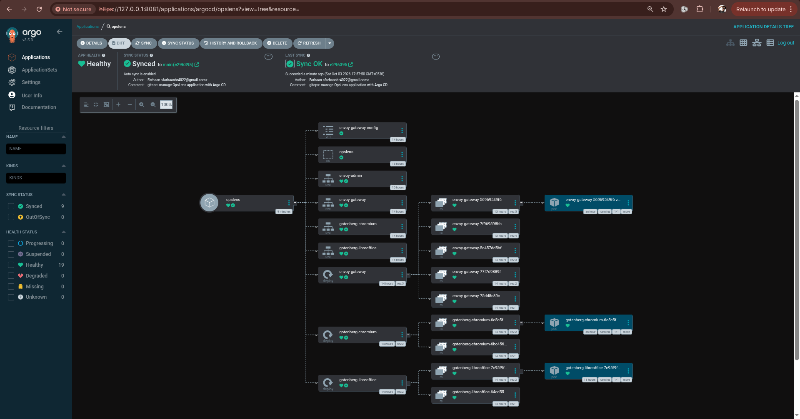
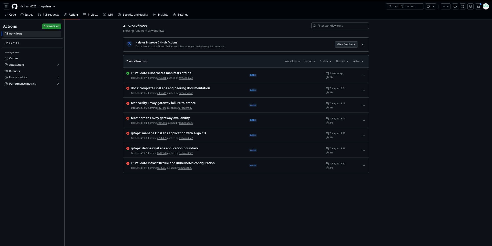

# OpsLens

**Reliability, overload, failure engineering, observability, and GitOps for a real document-processing workload on AWS and Kubernetes.**

OpsLens uses the open-source **Gotenberg** workload to study how Chromium and LibreOffice behave under concurrency, resource pressure, scaling, mixed traffic, and controlled failures. The project follows a measurement-first SRE loop:

**Baseline → Observe → Hypothesize → Change → Test → Measure → Compare**

<p align="center">
  
</p>

---

## What this project demonstrates

- Local workload characterization before introducing cloud complexity
- ECS/Fargate baseline and horizontal-scaling experiments
- EKS migration and workload isolation
- CPU HPA versus queue-aware autoscaling
- Prometheus metrics, Grafana dashboards, Loki logs, and OpenTelemetry collection
- Reliability recording rules and alert validation
- Controlled Kubernetes failure injection
- Persistent Loki storage through EBS CSI
- Durable PDF result validation through encrypted/versioned S3
- Asynchronous webhook validation
- GitHub Actions repository validation
- Argo CD GitOps reconciliation and self-healing
- Gateway high-availability hardening based on a measured failure

---

## Key measured results

| Engineering question | Result |
|---|---|
| How differently do the two engines behave? | Local saturation was roughly **19 RPS Chromium** vs **8 RPS LibreOffice** |
| Does ECS horizontal scaling help? | 2-task ECS improved throughput by **+93.9% Chromium** and **+85.3% LibreOffice** |
| Does workload isolation reduce interference? | Chromium mixed-load degradation improved from **21.1% → 4.8%** |
| Is CPU the best scaling signal? | CPU HPA scale decision: **36.6s**; queue-aware: **2.55s** |
| How fast was the second replica usable? | CPU HPA: **55.1s**; queue-aware: **5.3s** |
| What happened when the only Envoy failed? | **86/90** requests succeeded |
| What happened after gateway HA hardening? | **90/90** succeeded in the repeated controlled failure test |

These are bounded lab measurements, not universal production guarantees.

---

## Visual experiment evidence

### Workload isolation

The mixed-load experiment showed that isolating Chromium and LibreOffice improved predictability and reduced cross-engine interference.

<p align="center">
  
</p>

### Autoscaling control loop

Queue-aware scaling reacted much earlier than CPU HPA, while also demonstrating that faster scaling decisions do not automatically remove downstream application bottlenecks.

<p align="center">
  
</p>

### ECS horizontal scaling

<p align="center">
  
</p>

---

## Observability

The observability boundary is intentionally small:

- **Prometheus** — application and gateway metrics
- **Grafana** — metrics and log visualization
- **Loki** — persistent Kubernetes/application logs
- **OpenTelemetry Collector** — Kubernetes log collection and enrichment
- **CloudWatch** — AWS/EKS infrastructure and control-plane visibility

Distributed tracing was deliberately deferred rather than adding another system without a strong requirement.

### Grafana workload view

<p align="center">
  
</p>

### Real application and gateway logs

<p align="center">
  
</p>

### Prometheus alert validation

The alerting experiment intentionally made an OpsLens scrape target unavailable and verified that `OpsLensScrapeTargetDown` moved to **FIRING**.

<p align="center">
  
</p>

Recording rules and the full alert set are captured in the [visual evidence gallery](docs/evidence/screenshots/README.md).

---

## Failure engineering and production hardening

OpsLens deliberately injected failures rather than assuming Kubernetes recovery was sufficient.

### Chromium pod deletion

- 90 requests
- 89 successful
- 1 failed
- **98.89% success**

### Single Envoy gateway deletion

Before hardening:

- 90 requests
- 86 successful
- 4 failed
- **95.56% success**

This made the single gateway a measured availability weakness.

### Hardening change

The final gateway uses:

- **2 Envoy replicas**
- preferred pod anti-affinity using `kubernetes.io/hostname`
- PodDisruptionBudget with `minAvailable: 1`
- replicas placed on separate worker nodes

The repeated failure test completed:

- 90 requests
- 90 successful
- 0 failed
- **100.00% in that controlled run**

### Final Kubernetes state

<p align="center">
  
</p>

<p align="center">
  
</p>

---

## GitOps

Argo CD owns the active application boundary defined by `kubernetes/kustomization.yaml`.

It manages:

- OpsLens namespace
- Envoy ConfigMap
- Envoy Deployment and Services
- Envoy PodDisruptionBudget
- Chromium Deployment and Service
- LibreOffice Deployment and Service

Observability Helm releases and temporary validation resources remain outside the Argo application.

### Argo CD resource tree

<p align="center">
  
</p>

### Self-healing proof

A live replica-count drift was deliberately introduced. Argo reconciled the live Deployment back to the Git-defined desired state.

See:
- `docs/evidence/screenshots/gitops/argocd-reconciliation.png`
- `docs/evidence/screenshots/gitops/argocd-self-heal.png`

### GitHub Actions CI

The final CI run passed all four repository validation jobs:

- Terraform validation
- Kubernetes validation
- Script validation
- Repository hygiene

<p align="center">
  
</p>

---

## Durable result validation

OpsLens validates a real data path:

`HTML → Envoy → Gotenberg Chromium → PDF → private S3 → independent download → SHA-256 verification`

The validation harness checks:

- successful conversion response
- `%PDF-` signature
- file size
- SHA-256 checksum
- S3 AES256 server-side encryption
- object versioning
- independent re-download
- exact checksum match

A separate asynchronous experiment validates Gotenberg webhook delivery.

---

## Infrastructure ownership

| Layer | Owner |
|---|---|
| AWS infrastructure | Terraform |
| Prometheus / Grafana / Loki / OTel / Argo installation | Helm |
| Active OpsLens application | Argo CD / Kubernetes manifests |
| Repository validation | GitHub Actions |

This prevents multiple tools from silently competing for the same resources.

---

## Repository structure

```text
.
├── .github/workflows/             CI validation
├── docs/
│   ├── adr/                       architecture decisions
│   ├── architecture/              detailed architecture
│   ├── assets/                    architecture graphic
│   ├── evidence/
│   │   └── screenshots/           curated visual evidence
│   └── runbooks/                  debugging and teardown procedures
├── experiments/
│   ├── baseline/                  local experiments 001-008
│   └── cloud/                     ECS/EKS experiments 009-013
├── kubernetes/
│   ├── engines/
│   ├── gateway/
│   ├── gitops/
│   ├── observability/
│   └── validation/
├── scripts/                       validation harnesses
├── terraform/
│   ├── bootstrap/
│   └── infrastructure/
└── tools/                         load, scaling and metrics tooling
```

---

## Experiment progression

| Phase | Focus |
|---|---|
| 001-008 | Local workload characterization |
| 009 | ECS single-task baseline |
| 010 | ECS horizontal scaling |
| 011 | EKS single-pod baseline |
| 012 | Mixed-workload isolation |
| 013 | CPU HPA vs queue-aware autoscaling |
| 014 | Metrics and log observability |
| 015 | Reliability recording rules and alerts |
| 016 | Kubernetes failure engineering |
| 017 | Durable and asynchronous result validation |
| 018 | CI/CD and GitOps |
| 019 | Production availability hardening |

See the detailed [Evidence Index](docs/evidence/README.md) and [Visual Evidence Gallery](docs/evidence/screenshots/README.md).

---

## Security and scope

Selected controls include:

- private EKS worker subnets
- restricted cluster/API access
- restricted ALB ingress
- separate IAM responsibilities
- IRSA for AWS-integrated controllers
- private Grafana access through localhost port-forwarding
- internal-only Envoy admin Service
- private S3 result bucket with encryption/versioning/lifecycle
- reduced Envoy Linux capabilities
- no credentials committed to Git

OpsLens is an engineering lab, not a claim of production certification. Results are controlled experiments and are intentionally reported with their limits.

---

## Workload attribution

OpsLens uses the open-source **Gotenberg** project as the upstream workload. Original project work focuses on infrastructure, reliability, scaling, observability, fault experiments, automation, and measurable operational improvements.

See [ATTRIBUTION.md](ATTRIBUTION.md).
