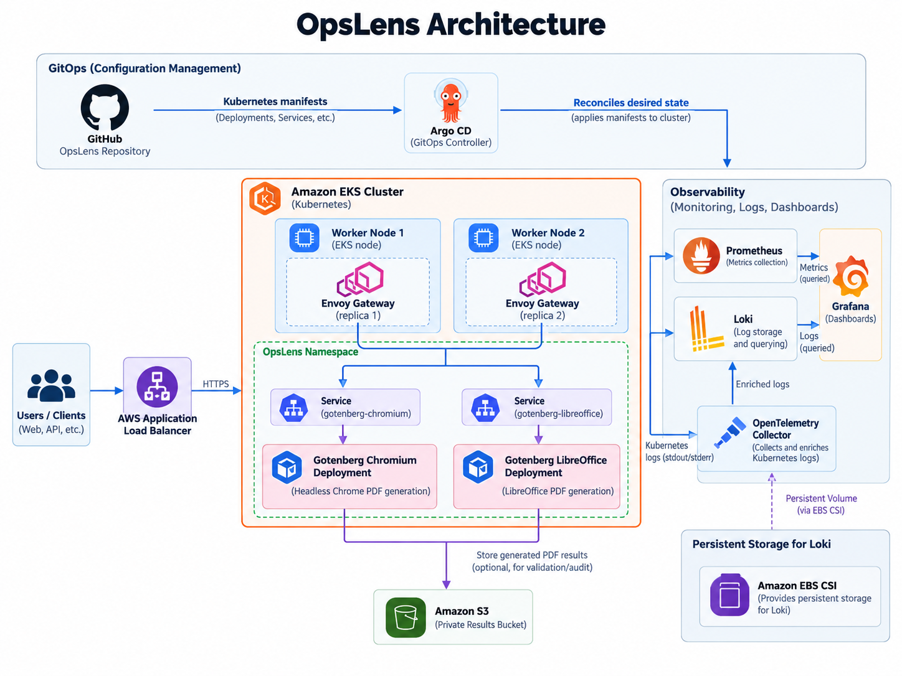

# OpsLens Architecture



## Design objective

The architecture is intentionally small enough to reason about. Every major component exists because an experiment or operational requirement justified it.

The final request path is:

`Client → AWS ALB → Envoy Gateway → Chromium or LibreOffice Gotenberg engine`

## Application path

### Ingress and gateway

AWS Load Balancer Controller reconciles the Kubernetes Ingress into an AWS Application Load Balancer. The ALB uses IP targets and forwards traffic directly to Envoy pod IPs.

Envoy provides path-based routing:

- `/forms/chromium/*` → Chromium engine
- `/forms/libreoffice/*` → LibreOffice engine
- `/health` → Chromium
- `/version` → Chromium
- `/prometheus/metrics` → Chromium

The final gateway layer runs two replicas. Preferred pod anti-affinity places them on different worker nodes when capacity allows. A PodDisruptionBudget requires at least one gateway replica to remain available during voluntary disruption.

### Engine isolation

Chromium and LibreOffice run as independent Deployments and Services. This emerged from mixed-workload experiments showing materially different CPU, memory, queue, and interference behavior.

Isolation gives OpsLens:

- independent resource controls
- independent scaling decisions
- clearer queue signals
- better fault isolation
- more predictable mixed-load behavior

## EKS and AWS identity

The EKS control plane and worker nodes use separate IAM roles because they have different responsibilities.

AWS-integrated Kubernetes controllers use IRSA through the cluster OIDC provider:

- AWS Load Balancer Controller
- EBS CSI controller

IRSA lets a specific Kubernetes ServiceAccount assume a scoped IAM role through `AssumeRoleWithWebIdentity` instead of relying on worker-node credentials.

## Observability

### Metrics

Prometheus scrapes Envoy and Gotenberg metrics. Recording rules derive request rate, 5xx rate, success ratio, and p95 latency. Grafana visualizes these signals.

### Logs

OpenTelemetry Collector runs as a DaemonSet and reads Kubernetes pod logs from each node. It enriches them with Kubernetes metadata and exports them to Loki.

Loki runs with persistent EBS gp3 storage. Persistence was validated across a Loki rollout by confirming a known log remained queryable afterward.

### Cloud visibility

CloudWatch remains responsible for AWS/EKS infrastructure and control-plane visibility. OpsLens does not duplicate that role inside the Kubernetes observability stack.

## Durable validation

A dedicated private S3 bucket is used for short-lived result-validation artifacts. The validation harness:

1. submits HTML through Envoy to Chromium;
2. receives a PDF;
3. validates the PDF signature and size;
4. computes SHA-256;
5. uploads the PDF and metadata to S3;
6. verifies AES256 server-side encryption and versioning;
7. downloads the object independently;
8. recomputes SHA-256 and requires an exact match.

A separate asynchronous experiment verifies Gotenberg webhook callbacks.

## GitOps ownership

Argo CD renders `kubernetes/kustomization.yaml` and manages only the active application boundary:

- Namespace
- Chromium Deployment and Service
- LibreOffice Deployment and Service
- Envoy ConfigMap
- Envoy Deployment
- Envoy Services
- Envoy PodDisruptionBudget

The legacy standalone Gotenberg workload, observability stack, and temporary validation receiver are deliberately outside that Argo application.

## Resource ownership model

```text
Terraform
  └── AWS infrastructure

Helm
  ├── Prometheus / Grafana
  ├── Loki
  ├── OpenTelemetry Collector
  └── Argo CD

Argo CD
  └── active OpsLens application manifests

GitHub Actions
  └── repository validation
```

Keeping ownership explicit prevents multiple controllers or tools from fighting over the same desired state.
